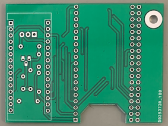

# ADX-S（CRkits共同購入プロジェクト）の改造

 CRkits共同購入プロジェクトで頒布されているADX-S FT8トランシーバ （https://jl1kra.sakura.ne.jp/ADX-S.html
 ) のCPUをESP32に置換し，Bluetooth Audio(HFP)でデータ通信することでPCとの接続を無線化しました．  

## Arduino NanoのESP32 Devkitへの置換とBluetooth AudioによるPCとの無線接続
ADX-Sは，WB2CBAにより開発されたADXを，BD6CRが受信部をシングルスーパーに改造・キット化し，CRkitsで頒布されています．  
これらは，CPUにArduino Nano(ATmega328)を使用しており，ADXの頭文字AがArduinoから取られています．  
このCPUを他のもっと強力なCPUに変えて機能を増やそうというプロジェクトが，さまざま試みられています．  
今回は，ESP32へ置換し，Bluetooth Audioによる無線化を試みました．  

Bluetoothで使用できる音響用プロファイルはA2DPとHFP(HSP)です．  
A2DPは音楽転送用で，基本的に44.1kHzサンプリングのステレオデータを送受信できます．  
"Arduino IDE"で使用できるプログラムが開発され，公開されています．  
但し，1個のESP32で，送信と受信の両方を行うことはできず，ADX-Sの無線化には最低2個のESP32が必要です．  
もう一つ厄介なことに，ESP32からPCへの音響データ送信（すなわちADX-Sのデジタルモード受信時）に問題があります．  
WindowsやMacOSでは，A2DPの受信は基本的にサポートされていません．  
Windowsには，"Bluetooth Audio Receiver"というソフトがあって，スマートフォンなどの音楽をA2DPで受信してスピーカーで再生することができます．  
しかし，ESP32とではうまく通信できませんでした．  
これを回避するには，ESP32から市販のBluetooth Audioレシーバー(あるいは別のESP32で作ったA2DPレシーバー)に送って，アナログ音響信号にしてPCのマイク端子に入力することが必要です．  
しかし，これでは，全体でESP32を2個+市販のBluetooth Audioレシーバー，あるいはESP32を3個が必要となり，お手軽とはならなそうです．  
そこで，別のもう一つの方法であるHFP(HSP)を試みました．  
HFPは携帯電話をbluetoothヘッドセットで受けて通信に使用する際につかうプロファイルで，"Arduino IDE"で使用できるフログラム例は見当たらず，"esp-idf"での開発が必要でした．  
HFPでは，基本的に8kHzサンプリングのモノラルデータを送受信しますが，近年16kHzサンプリングデータの送受信（HD Voice, mSBC)も可能になっています．  
Macでは基本的に8kHzサンプリングで接続するようで，WindowsではBluetoothアダプタにもよりますが基本的に16kHzで接続するようでした．  
PCの音響信号から変調周波数を決定するのも16kHzサンプリングでしたら比較的簡単にできそうです．  
このため，まずは16kHzサンプリングでの接続を念頭にプログラム開発を行いました．  
"esp-idf"にあるプログラム例は"hfp_hf"なのですが，16kHzサンプリング接続のコーデック処理が不完全なようでPCからESP32に送った音響データが歪んでしまい，変調周波数を正確に決定できませんでした．  
このため，次に別のBluetooth用ソフトである"BTstack"を使用し，そのプログラム例”hfp_hf_demo”を出発点としてプログラム開発を行いました．  
この場合にはPCからESP32への音響データ転送はうまく行ったのですが，ESP32からPCへ送る信号が歪んでしまい，鋭いはずの単色音のスペクトルが少しブロードになってしまいました．  
また，このとき，PC上でWSJT-Xを動かすと，スペクトル表示やウォーターフォールではFT8の受信信号が確認できるものの，デコードはできませんでした．  
このため，最終的には16kHzサンプリング接続（HD Voice, mSBC)を諦めて，強制的に8kHz接続で行うことにして，なんとかうまくいきました．  
結局，"BTstack"のサンプルプログラム”hfp_hf_demo”を出発とし，8kHzサンプリング接続のファームウェアとなりました．  

具体的な改造は以下の3点です．  

### 1．ADX-Sメイン基板の一部変更 
	ADX-Sでは，Arduino Nanoが直付けされていますが，Arduino Nanoを取り外し，ピンコネクタ接続に変更しました．  
	現在の12mmの真鍮スペーサーを長めのもの(例えば20mm)に変えれば，裏側パネルを付けることができます． 
	CD2003の出力信号をESP32のADC端子に接続するために，CD2003のDEC_OUT - C7(470nF)間と元のArduino Nanoの21番ピン(A2ピン)の間を接続します．  
	（写真のオレンジ色のジャンパー線）  
	ADX-SのATT, AGC改造をお薦めします(改造を行ったADX-Sでテストしました．)．  
	ESP32 Devkitを逆さ向きで取り付けるため，R5,R6,R7,R8,R9,R10,R11,R15を横に寝かせる必要があります．  
	寝かせないと，ESP32とショートしてしまします(ショートが心配な方はテープなどで処理して下さい)．  
メイン基板表側  
メイン基板裏側  

### 2．Arduino NanoピンコネクタからESP32 Devkitピンコネクタへの変換基板の製作
	Arduino NanoピンコネクタにESP32 Devkitを取り付けるための変換基板を作りました． 
	部品類は基本的に全て基板の下側につけて，全体の高さがなるべく低くなるようにしています． 
	このため，ESP32が裏向きについており，リセットボタンなどが押しにくくなっています． 
	また，ESP32の無線アンテナが裏側パネルでシールドされるのを防ぐために，アンテナが外側(手前)になるようにレイアウトしていますので，USBコネクタが内側（奥側）になっています． 
	ファームウエアの書き込みの際には，メイン基板から取り外して行った方がやり易いかも知れません． 
	幅の違う2種類の38ピンESP32 Devkitが使えるようにしています． 
	純正のESP32 Devkit Cでは，アンテナが基板の外側に出ます． 
	Arduino NanoではIO電圧が基本5Vで，ESP32では3.3Vなのですが，そのままでも作動しました． 
	一方，Arduino Nanoは12V電源を直結できますが，ESP32 Devkitは外部電源電圧5Vですので，変換基盤に電圧レギュレーターを載せています． 
	TO-220の7805もしくはピン互換のDC-DCモジュールが使えます． 
	シリーズレギュレーターは発熱します．DC-DCモジュールは高効率ですが少し高価です． 
	CD2003Pの受信信号をESP32のADCで取り込んでいますが，感度が不足したので，2N3904を使った1石アンプを付けています． 
	メイン基版につけるときは，Arduino Nanoピンコネクタが無い側にスペーサ(11mmが最適)をつけて下さい． 
ブリッジ基板  
部品セットずみ(7805)  
部品セットずみ(DC-DCモジュール)  
メイン基板に取り付け済み  
回路図は，  
  
JLCPCB用のガーバーファイルは"nano_ESP32_bridge_gerber.zip"です．  
また， Kicadのファイルは"nano_ESP32_bridge_kicad.zip"です．  

### 3．ファームウェア  
	esp-idf(ver4.4.5) + BTstack (サンプルプログラム"hfp_hf_demo"を利用)環境で作っています．  
	Bluetooth Audio部分は，”hfp_hf_demo”ほぼそのままですが，16kHzサンプリング(HD Voice, mSBC)での通信を無効にしています．   
	Bluetooth AudioとADC間の音声信号のやりとりなどは，atomic14の以下のプログラムを元にしています．   
	https://github.com/atomic14/esp32-hsp-hf

	adx.c, adx.hがトランシーバー制御部分です．  
	PCから受け取った音響データをQP-7C_RP2040と同様な処理をしてデジタル信号の周波数を算出しています．  
	但し，サンプリングレートが8kHzと低いので，1パケット分(7.5mS)を平均することで，なんとか精度を保っています．  
	また，サンプリングレート48kHzのQP-7C_RP2040での処理ルーチンでは，負から正になる時刻を使って周期測定を行なっていましたが，今回は正から負になる点も含めて計算しています．  
	8kHzサンプリングデータでも，音響周波数2700Hz程度以下までは1Hz程度の精度で周波数を算出できているようです．  
	受信時のCD2003からの音響信号は，トランジスタで増幅した後，ESP32のADCで取り込んでいます．  
	64kHzでADCサンプリングし，8個のデータを積算して8kHzサンプリングデータとし，bluetooth(HFP)で送っています．  
	受信入力信号が大きすぎる場合には，1092行目のgain_reduceの値を大きくしてみて下さい．  

	音響データ処理以外のトランシーバー制御プログラムは，ADX-S v1.3JPを元にしています．  
	https://jl1kra.sakura.ne.jp/ADX_S_V1.3JP.ino
	Si5351の制御には，NT7Sの”Si5351 Library for avr-gcc” https://github.com/NT7S/Si5351 のi2c通信部分を書き換えて使用しました．  
	（このLibraryの周波数設定単位は1Hzで，”Si5351 Library for Arduino”の0.01Hzとは異なっています．）  

	CATは未実装です．  

## ファームウェアのビルドとインストール  
	"esp-idf"のversion 4.4をインストールします(現時点では，version 4.4.5)．  
	https://docs.espressif.com/projects/esp-idf/en/release-v4.4/esp32/index.html
	version 5.x 以降には対応していないと思います．  
	"BTstack"をインストールします．  
	https://github.com/bluxekitchen/btstack
	ESP32用にセットアップします．  
	ADX-S_ESP32フォルダのファームウェアをビルドし，ESP32にフラッシュします．  
	ファームウエアの書き込みの際には，メイン基板から取り外して行った方がやり易いと思います． 

	PCにおいて，bluetoothデバイスの追加で，"HFP HF Demo xx:xx:xx:xx:xx:xx"に接続して下さい(xx:xx:...は機器のアドレス)．  
	接続後，WSJT-Xの設定→サウンドカードの入力および出力でヘッドセット(HFP)を選択して設定して下さい．  
	WSJT-Xの送信出力は控えめにした方が，2千数百Hz以上の高い周波数での送信周波数決定精度が上がります．  
	ADX-Sが送信するギリギリより少し大きめ程度に設定して下さい．  
	また，送信は基本的に2700Hz程度以下で行なって下さい．  
	bluetooth通信が不調になって受信できなくなったら，WSJT-Xを立ち上げなおしてみて下さい．  
	
#### 必要部品(2023年10月20日時点の価格)  
	ESP32 Devkit module ：1個　
	分割ロングピンソケット　１×４２（CPUソケット受け）：1個　秋月電子，1個80円　https://akizukidenshi.com/catalog/g/gC-05779/  
	ピンヘッダ　１×４０（CPUソケット）：1個　秋月電子，1個35円　https://akizukidenshi.com/catalog/g/gC-00167/
	三端子レギュレーター 5Ｖ(TO-220)：例えば L7805CV-DG 秋月電子，90円  https://akizukidenshi.com/catalog/g/gI-07903/
	 あるいは 5V出力DC-DCコンバータ：例えば M78AR05-0.5 秋月電子，480円  https://akizukidenshi.com/catalog/g/gM-07179/
	トランジスター　2N3904：1個 例えば，秋月電子，20個入り 180円　https://akizukidenshi.com/catalog/g/gI-05962/
	積層セラミックコンデンサー105：2個    
	抵抗　2.2kΩ：1個  
	抵抗　10kΩ：2個  
	抵抗　100kΩ：1個  
